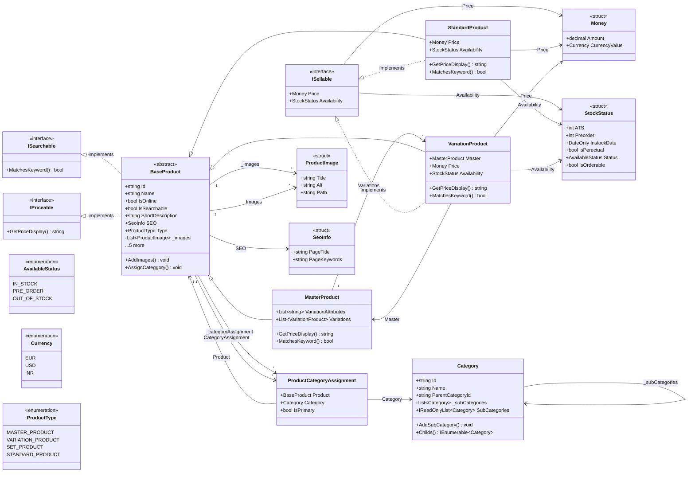

<!-- JOURNEY:START -->
<!-- Generated by tools/JourneyGen. Do not edit by hand: your changes will be overwritten. -->

## My .NET Journey

_A running record of the C# and .NET ground I have actually covered, generated from this repository on every push._

    

**Progress** `█████████████░░░░░░░` **67%**

📊 **[Full dashboard with charts and timeline](https://yammanuresreekanth.github.io/csharp-mini-project/)**

### Current focus

What I am working on right now · assigned 2026-08-25 · next review **2026-09-22**

`█████████░░░░░░░░░░░` **3 of 7 complete** · 4 in progress

| Item | Status | Evidence in the code |
|---|---|---|
| DI & IoC | ✅ Completed | `Ecom.MvcWebApp/Program.cs` |
| List, IList and IEnumerable the trade-off between exposing a concrete list and an abstraction | ✅ Completed | ✓ `List<T>` Catalog.ConsoleApp/DataAccess/CategoryRepository.cs ✓ `IReadOnlyList<T>` Catalog.ConsoleApp/Domain/Classes/Category/Category.cs ✗ `IList<T>` ✓ `IEnumerable<T>` Catalog.ConsoleApp/Domain/Classes/Category/Category.cs |
| Async | ✅ Completed | `Ecom.MvcWebApp/Middlewares/RequestLogging.cs` +1 |
| ILogger | 🔄 In progress | _none yet_ |
| Structured logging message templates with named placeholders, not string interpolation | 🔄 In progress | _none yet_ |
| Service Bus | 🔄 In progress | _none yet_ |
| IDisposable | 🔄 In progress | ✓ `Consumed with using` Catalog.ConsoleApp/DataAccess/MySQLConnection.cs ✗ `Implemented myself` |

> **Marked complete, but the code does not fully show it yet:** List, IList and IEnumerable.
> Status above is my own; the evidence column is generated from the source, so the two can disagree.

### Domain model

_Generated from the source on every push — this diagram cannot drift from the code._

### Projects

| Project | Files | Lines | Types |
|---|---:|---:|---:|
| `Ecom.MvcWebApp` | 22 | 804 | 26 |
| `Catalog.ConsoleApp` | 29 | 758 | 30 |
| `Ecom.WebApiApp` | 1 | 42 | 1 |

### Who wrote this code

**100% of the application code is mine** — 1295 of the 1295 lines in it that anyone authored by hand.
A further 79 lines are `dotnet new` template output, which neither I nor an AI wrote.

| Project | Mine | AI | Scaffold | Share authored by me |
|---|---:|---:|---:|---|
| `Catalog.ConsoleApp` | 689 | 0 | 0 | `████████████████████` 100% |
| `Ecom.MvcWebApp` | 606 | 0 | 46 | `████████████████████` 100% |
| `Ecom.WebApiApp` | 0 | 0 | 33 | — _template output only_ |
| **Application total** | **1295** | **0** | **79** | `████████████████████` **100%** |

How this is measured, and what is declared

Every non-blank line is attributed with `git blame` to the commit that last touched it,
and each commit is classified once. Lines count as mine by default — a line is only
AI or scaffold because a rule in `journey.json` says so. Edit a scaffold line and blame
reassigns it to me automatically, so the split cannot drift from the code.

Going forward this is automatic: any commit whose message carries an AI trailer
(`Co-Authored-By: Claude`, `Assisted-By: Claude`) has its lines counted as AI-written.

The AI-written tooling totals and the commit-by-commit audit trail, with a link to
each declared commit, are on the dashboard under **How this is measured**.

### .NET backend engineering skills

_The ground I want to cover for my career in .NET._

`████░░░░░░░░░░░░░░░░` **36 of 178 covered** across 14 areas

The long-range picture. Most of it is untouched, which is the point — it shows the scope and where I am in it. Items marked not code-detectable are judgement topics no detector can honestly prove.

| Area | Covered | |
|---|---:|---|
| C# and modern .NET depth | 14/22 | `█████████████░░░░░░░` 64% |
| ASP.NET Core Web APIs | 6/14 | `█████████░░░░░░░░░░░` 43% |
| Domain-Driven Design | 4/10 | `████████░░░░░░░░░░░░` 40% |
| Microservices architecture | 0/11 | `░░░░░░░░░░░░░░░░░░░░` 0% |
| Event-driven architecture and messaging | 0/13 | `░░░░░░░░░░░░░░░░░░░░` 0% |
| Azure cloud services | 0/10 | `░░░░░░░░░░░░░░░░░░░░` 0% |
| Infrastructure as Code (Bicep) | 0/20 | `░░░░░░░░░░░░░░░░░░░░` 0% |
| Databases and data modeling | 5/11 | `█████████░░░░░░░░░░░` 45% |
| Testing and code quality | 0/11 | `░░░░░░░░░░░░░░░░░░░░` 0% |
| CI/CD and DevOps basics | 3/12 | `█████░░░░░░░░░░░░░░░` 25% |
| Integrations with external systems | 0/13 | `░░░░░░░░░░░░░░░░░░░░` 0% |
| Observability and production readiness | 1/13 | `██░░░░░░░░░░░░░░░░░░` 8% |
| Security basics | 2/10 | `████░░░░░░░░░░░░░░░░` 20% |
| AI-assisted development | 1/8 | `██░░░░░░░░░░░░░░░░░░` 12% |

<b>C# and modern .NET depth</b> — 14/22 · Strong enough that C# feels natural.

- [x] **Classes and interfaces** `Catalog.ConsoleApp/CustomAttributes/InfoAttribute.cs` +3
- [x] **Records** `Ecom.WebApiApp/Program.cs`
- [x] **Generics** `Catalog.ConsoleApp/DataAccess/CategoryRepository.cs` +3
- [ ] Delegates and events
- [x] **LINQ** `Catalog.ConsoleApp/DataAccess/ProductRepository.cs` +3
- [x] **async / await / Task** `Ecom.MvcWebApp/Middlewares/RequestLogging.cs` +1
- [ ] Cancellation tokens
- [ ] Parallelism
- [x] **Dependency injection** `Ecom.MvcWebApp/Program.cs`
- [x] **Configuration** `Ecom.MvcWebApp/Program.cs`
- [x] **Error handling** `Catalog.ConsoleApp/DataAccess/MySQLConnection.cs`
- [x] **Logging** `Catalog.ConsoleApp/Logging/Logger.cs`
- [x] **Validation** `Ecom.MvcWebApp/Controllers/EmployeesController.cs` +3
- [ ] SOLID principles — judgement, not detectable judgement — not code-detectable
- [ ] Clean code — judgement, not detectable judgement — not code-detectable
- [ ] Garbage collection basics — judgement, not detectable judgement — not code-detectable
- [x] **Value vs reference types** `Catalog.ConsoleApp/CustomAttributes/InfoAttribute.cs` +3
- [ ] IDisposable
- [x] **.NET 8/9 app structure** `Catalog.ConsoleApp/Catalog.ConsoleApp.csproj` +2
- [x] **Minimal APIs** `Ecom.WebApiApp/Program.cs`
- [x] **ASP.NET Core Web APIs** `Ecom.MvcWebApp/Ecom.MvcWebApp.csproj` +1
- [ ] Build and explain a production-style API — the real bar for this area judgement — not code-detectable

<b>ASP.NET Core Web APIs</b> — 6/14 · Central to the role.

- [ ] REST API design judgement — not code-detectable
- [x] **Controllers** `Ecom.MvcWebApp/Controllers/CategoryController.cs` +3
- [x] **Minimal APIs** `Ecom.WebApiApp/Program.cs`
- [x] **Middleware pipeline** `Ecom.MvcWebApp/Program.cs` +1
- [x] **Custom middleware** `Ecom.MvcWebApp/Middlewares/RequestLogging.cs` +1
- [ ] Authentication
- [ ] Authorization
- [x] **Model binding and validation** `Ecom.MvcWebApp/Controllers/EmployeesController.cs` +1
- [ ] API versioning
- [x] **Swagger / OpenAPI** `Ecom.WebApiApp/Program.cs`
- [ ] Structured error responses
- [ ] Health checks
- [ ] Rate limiting
- [ ] Resilience

<b>Domain-Driven Design</b> — 4/10 · Explicitly named in the role.

- [x] **Entities and value objects** `Catalog.ConsoleApp/Domain/Classes/Category/Category.cs` +3
- [ ] Aggregates and aggregate roots
- [x] **Repositories** `Catalog.ConsoleApp/DataAccess/CategoryRepository.cs` +3
- [x] **Factories** `Catalog.ConsoleApp/Factories/CategoryFactory.cs` +1
- [ ] Domain events
- [ ] Specification pattern
- [ ] Bounded contexts judgement — not code-detectable
- [ ] Ubiquitous language judgement — not code-detectable
- [x] **Application vs domain layer** `Catalog.ConsoleApp/Domain/Classes/Category/Category.cs` +3
- [ ] Practice project: tailoring order management — orders, measurements, alterations, payments, shipping judgement — not code-detectable

<b>Microservices architecture</b> — 0/11 · Know when they help and when they cost.

- [ ] Service boundaries judgement — not code-detectable
- [ ] Database-per-service judgement — not code-detectable
- [ ] API gateway basics judgement — not code-detectable
- [ ] Synchronous vs asynchronous communication judgement — not code-detectable
- [ ] Service discovery judgement — not code-detectable
- [ ] Distributed transactions judgement — not code-detectable
- [ ] Saga pattern
- [ ] Idempotency
- [ ] Eventual consistency judgement — not code-detectable
- [ ] Observability across services judgement — not code-detectable
- [ ] Knowing when not to split — the answer they want to hear in interviews judgement — not code-detectable

<b>Event-driven architecture and messaging</b> — 0/13 · One of the biggest topics for the role.

- [ ] Queues vs topics judgement — not code-detectable
- [ ] Commands vs events judgement — not code-detectable
- [ ] Publish / subscribe judgement — not code-detectable
- [ ] Azure Service Bus queues
- [ ] Azure Service Bus topics
- [ ] Dead-letter queues
- [ ] Retries
- [ ] Poison messages judgement — not code-detectable
- [ ] Idempotent message handling
- [ ] Outbox pattern
- [ ] Message ordering
- [ ] Duplicate detection
- [ ] OrderCreated fan-out scenario — inventory, payments, warehouse, email, CRM react independently

<b>Azure cloud services</b> — 0/10 · The services named on the profile.

- [ ] Azure App Service
- [ ] Azure Functions
- [ ] Azure Service Bus
- [ ] Azure Cosmos DB
- [ ] Azure Table Storage
- [ ] Azure Storage Accounts
- [ ] Application Insights
- [ ] Azure Key Vault
- [ ] Azure Monitor judgement — not code-detectable
- [ ] Managed identities

<b>Infrastructure as Code (Bicep)</b> — 0/20 · Declaring the whole backend, not clicking it together in the portal.

- [ ] Bicep templates
- [ ] Resource declarations
- [ ] targetScope and resource groups
- [ ] Parameters
- [ ] Parameter files (.bicepparam)
- [ ] Decorators — @description, @allowed, @secure
- [ ] Variables and expressions
- [ ] Modules — composing templates instead of one long file
- [ ] Outputs
- [ ] Referencing existing resources
- [ ] Deploying App Service
- [ ] Deploying Azure Functions
- [ ] Deploying Service Bus
- [ ] Deploying Cosmos DB
- [ ] Deploying Key Vault and secrets
- [ ] Managed identity and RBAC in Bicep
- [ ] Environment-specific configuration — one template, parameterised per environment
- [ ] Linting and bicep build
- [ ] Previewing with what-if — see the change before it lands
- [ ] Deploying from CI

<b>Databases and data modeling</b> — 5/11 · Relational and NoSQL thinking.

- [x] **SQL Server basics** `Catalog.ConsoleApp/Catalog.ConsoleApp.csproj` +3
- [x] **Hand-written SQL** `Catalog.ConsoleApp/Computation/Reset catalog schema.SQL` +3
- [x] **Entity Framework Core** `Ecom.MvcWebApp/Data/ApplicationDbContext.cs` +3
- [x] **Migrations** `Ecom.MvcWebApp/Migrations/20260920132203_InitialCreate.Designer.cs` +2
- [x] **Indexing** `Catalog.ConsoleApp/Computation/Reset catalog schema.SQL` +1
- [ ] Transactions
- [ ] Optimistic concurrency
- [ ] Cosmos DB partition keys — poor choices are expensive and hard to undo
- [ ] Document modeling judgement — not code-detectable
- [ ] Table Storage design
- [ ] Relational vs NoSQL choice judgement — not code-detectable

<b>Testing and code quality</b> — 0/11 · Called out in the job description.

- [ ] xUnit or NUnit
- [ ] Unit tests
- [ ] Mocking
- [ ] Integration testing
- [ ] Testing APIs judgement — not code-detectable
- [ ] Testing message handlers judgement — not code-detectable
- [ ] Contract testing
- [ ] Testcontainers
- [ ] Clean architecture testability judgement — not code-detectable
- [ ] Code review principles judgement — not code-detectable
- [ ] Explaining what you do not test, and why judgement — not code-detectable

<b>CI/CD and DevOps basics</b> — 3/12 · They expect pipeline improvements.

- [x] **Git fundamentals** `.gitignore`
- [ ] Branching strategies judgement — not code-detectable
- [ ] Pull requests judgement — not code-detectable
- [x] **Build pipelines** `.github/workflows/journey.yml`
- [x] **GitHub Actions** `.github/workflows/journey.yml`
- [ ] Automated tests in CI
- [ ] Static analysis
- [ ] Secrets management
- [ ] Release pipelines judgement — not code-detectable
- [ ] Environment promotion — dev, test, staging, production judgement — not code-detectable
- [ ] Rollback strategies judgement — not code-detectable
- [ ] Blue-green or slot deployments judgement — not code-detectable

<b>Integrations with external systems</b> — 0/13 · Salesforce, Dynamics, WMS, POS, OMS, WeChat.

- [ ] REST integrations
- [ ] Typed API clients
- [ ] Webhooks
- [ ] Authenticating with external APIs judgement — not code-detectable
- [ ] OAuth basics
- [ ] Retry policies
- [ ] Circuit breakers
- [ ] Rate limits
- [ ] Data mapping
- [ ] Anti-corruption layer judgement — not code-detectable
- [ ] Integration events
- [ ] Reconciliation jobs judgement — not code-detectable
- [ ] Handling partial failure judgement — not code-detectable

<b>Observability and production readiness</b> — 1/13 · “It works locally” is not enough.

- [ ] Structured logging
- [x] **Correlation IDs** `Ecom.MvcWebApp/Controllers/HomeController.cs`
- [ ] Distributed tracing
- [ ] Metrics
- [ ] Application Insights
- [ ] Health checks
- [ ] Dashboards judgement — not code-detectable
- [ ] Alerts judgement — not code-detectable
- [ ] Performance monitoring judgement — not code-detectable
- [ ] Exception tracking judgement — not code-detectable
- [ ] Diagnosing slow APIs judgement — not code-detectable
- [ ] Diagnosing failed messages judgement — not code-detectable
- [ ] Answering “how would you know this is healthy in production?” judgement — not code-detectable

<b>Security basics</b> — 2/10 · Production awareness, not specialism.

- [ ] OAuth2 / OpenID Connect
- [ ] JWT tokens
- [ ] Role-based authorization
- [ ] Secrets in Key Vault
- [ ] Managed identities
- [x] **HTTPS** `Ecom.MvcWebApp/Program.cs` +1
- [x] **Input validation** `Ecom.MvcWebApp/Controllers/EmployeesController.cs` +3
- [ ] OWASP Top 10 basics judgement — not code-detectable
- [ ] Secure API design judgement — not code-detectable
- [ ] Least privilege access judgement — not code-detectable

<b>AI-assisted development</b> — 1/8 · Use it professionally, not blindly.

- [ ] Generate boilerplate faster judgement — not code-detectable
- [ ] Refactor code with review judgement — not code-detectable
- [ ] Write tests with AI judgement — not code-detectable
- [ ] Explain unfamiliar code judgement — not code-detectable
- [ ] Generate infrastructure templates judgement — not code-detectable
- [ ] Improve documentation judgement — not code-detectable
- [ ] Validate AI output through tests and review judgement — not code-detectable
- [x] **Declaring AI authorship honestly** — the provenance tracking in this repo `journey.json`

### Concepts covered

<b>C# fundamentals</b> — 9/12

- [x] **Classes** `Catalog.ConsoleApp/CustomAttributes/InfoAttribute.cs` +5
- [x] **Structs** — value types `Catalog.ConsoleApp/Domain/Structs/Money.cs` +3
- [x] **Enums** `Catalog.ConsoleApp/Domain/Enums/AvailableStatus.cs` +2
- [x] **Properties** `Catalog.ConsoleApp/CustomAttributes/InfoAttribute.cs` +5
- [x] **var / implicit typing** `Ecom.MvcWebApp/Controllers/LinqController.cs` +2
- [x] **String interpolation** `Catalog.ConsoleApp/CustomExtensions/SqlDataReaderExtensions.cs` +5
- [x] **foreach** `Catalog.ConsoleApp/DataAccess/MySQLConnection.cs` +4
- [ ] switch
- [ ] Optional parameters
- [ ] out parameters
- [x] **params arrays** `Catalog.ConsoleApp/Logging/Logger.cs`
- [x] **Console I/O** `Catalog.ConsoleApp/CustomExtensions/SqlDataReaderExtensions.cs` +5

<b>Object-oriented design</b> — 8/15

- [x] **Interfaces** `Catalog.ConsoleApp/DataAccess/ICategoryRepository.cs` +5
- [x] **Inheritance** `Catalog.ConsoleApp/Domain/Classes/Product/MasterProduct.cs` +2
- [x] **Abstract classes** `Catalog.ConsoleApp/Domain/Classes/Product/BaseProduct.cs`
- [x] **Abstract members** `Catalog.ConsoleApp/Domain/Classes/Product/BaseProduct.cs`
- [x] **Overriding** `Catalog.ConsoleApp/Domain/Classes/Product/MasterProduct.cs` +5
- [ ] virtual members
- [ ] Default interface methods
- [x] **Static classes** `Catalog.ConsoleApp/CustomExtensions/SqlDataReaderExtensions.cs` +4
- [ ] Sealed classes
- [x] **Generics** `Catalog.ConsoleApp/DataAccess/CategoryRepository.cs` +5
- [x] **Generic types of my own** `Catalog.ConsoleApp/DataAccess/MySQLConnection.cs`
- [ ] Delegates
- [ ] Events
- [ ] Indexers
- [ ] Operator overloading

<b>Modern C#</b> — 13/17

- [x] **Records** `Ecom.WebApiApp/Program.cs`
- [x] **init-only properties** `Catalog.ConsoleApp/Domain/Classes/Category/Category.cs` +1
- [ ] required members
- [x] **Pattern matching** `Catalog.ConsoleApp/DataAccess/ProductRepository.cs` +3
- [ ] switch expressions
- [x] **Nullable reference types** `Catalog.ConsoleApp/CustomExtensions/SqlDataReaderExtensions.cs` +5
- [x] **?. and ?[]** `Catalog.ConsoleApp/CustomExtensions/SqlDataReaderExtensions.cs` +2
- [x] **?? and ??=** `Ecom.MvcWebApp/Controllers/HomeController.cs`
- [x] **Expression-bodied members** `Catalog.ConsoleApp/Domain/Classes/Category/Category.cs` +3
- [x] **Top-level statements** `Ecom.MvcWebApp/Program.cs` +1
- [x] **File-scoped namespaces** `Catalog.ConsoleApp/CustomExtensions/SqlDataReaderExtensions.cs` +5
- [x] **Target-typed new** `Catalog.ConsoleApp/DataAccess/MySQLConnection.cs`
- [x] **Collection expressions** `Catalog.ConsoleApp/Services/CatalogService.cs`
- [ ] Primary constructors
- [ ] Tuples
- [x] **Lambdas** `Catalog.ConsoleApp/DataAccess/CategoryRepository.cs` +5
- [x] **Object initializers** `Catalog.ConsoleApp/DataAccess/CategoryRepository.cs` +4

<b>Collections & LINQ</b> — 6/9

- [x] **Generic collections** `Catalog.ConsoleApp/DataAccess/CategoryRepository.cs` +5
- [x] **LINQ** `Catalog.ConsoleApp/DataAccess/ProductRepository.cs` +4
- [x] **LINQ method syntax** `Catalog.ConsoleApp/DataAccess/ProductRepository.cs` +4
- [ ] LINQ query syntax
- [ ] Extension methods
- [x] **Iterators (yield)** `Catalog.ConsoleApp/Domain/Classes/Category/Category.cs`
- [x] **IEnumerable<T>** `Catalog.ConsoleApp/Domain/Classes/Category/Category.cs` +1
- [ ] IList<T>
- [x] **IReadOnlyList<T>** `Catalog.ConsoleApp/Domain/Classes/Category/Category.cs` +1

<b>Errors, resources & async</b> — 7/13

- [x] **try / catch** `Catalog.ConsoleApp/DataAccess/MySQLConnection.cs`
- [x] **Throwing exceptions** `Catalog.ConsoleApp/DataAccess/CategoryRepository.cs` +4
- [x] **Custom exceptions** `Catalog.ConsoleApp/CustomExceptions/NoProductsFoundException.cs`
- [ ] Exception filters
- [ ] finally blocks
- [x] **using / IDisposable** `Catalog.ConsoleApp/DataAccess/MySQLConnection.cs` +1
- [x] **Custom attributes** `Catalog.ConsoleApp/CustomAttributes/InfoAttribute.cs`
- [x] **Logging** `Catalog.ConsoleApp/Logging/Logger.cs`
- [x] **async / await** `Ecom.MvcWebApp/Middlewares/RequestLogging.cs` +1
- [ ] Task / ValueTask
- [ ] ILogger
- [ ] Structured logging
- [ ] IDisposable implemented

<b>Data access</b> — 6/7

- [x] **ADO.NET** — raw SqlConnection / SqlDataReader `Catalog.ConsoleApp/DataAccess/MySQLConnection.cs`
- [x] **Hand-written SQL** `Catalog.ConsoleApp/Computation/Reset catalog schema.SQL` +4
- [x] **Repository pattern** `Catalog.ConsoleApp/DataAccess/CategoryRepository.cs` +3
- [x] **Factory pattern** `Catalog.ConsoleApp/Factories/CategoryFactory.cs` +1
- [x] **Service layer** `Catalog.ConsoleApp/Services/CatalogService.cs` +1
- [x] **EF Core** — next up `Ecom.MvcWebApp/Data/ApplicationDbContext.cs` +4
- [ ] EF migrations — roadmap planned

<b>ASP.NET Core</b> — 12/13

- [x] **Dependency injection** `Ecom.MvcWebApp/Program.cs`
- [x] **Middleware pipeline** `Ecom.MvcWebApp/Program.cs` +1
- [x] **MVC controllers** `Ecom.MvcWebApp/Controllers/CategoryController.cs` +5
- [x] **MVC routing** `Ecom.MvcWebApp/Program.cs`
- [x] **Razor views** `Ecom.MvcWebApp/Views`
- [x] **Static files** `Ecom.MvcWebApp/wwwroot`
- [x] **Minimal APIs** `Ecom.WebApiApp/Program.cs`
- [x] **OpenAPI / Swagger** `Ecom.WebApiApp/Program.cs`
- [x] **Configuration binding** `Ecom.MvcWebApp/Program.cs`
- [ ] Authentication — roadmap planned
- [x] **IoC container** `Ecom.MvcWebApp/Program.cs`
- [x] **DI lifetimes** — scoped / singleton / transient `Ecom.MvcWebApp/Program.cs`
- [x] **Custom middleware** `Ecom.MvcWebApp/Middlewares/RequestLogging.cs`

<b>Messaging & integration</b> — 0/3

- [ ] Azure Service Bus
- [ ] HttpClient
- [ ] Background services

<b>Tooling & practice</b> — 2/5

- [x] **Multi-project solution** `csharp-ecom-mini-app.slnx`
- [x] **CI with GitHub Actions** `.github/workflows/journey.yml`
- [ ] Unit tests — roadmap
- [ ] Docker — roadmap
- [ ] Deployment — roadmap planned

Last updated 2026-09-21 15:54 UTC

<!-- JOURNEY:END -->

# Catalog Console App - Domain & Database Diagrams

This document collects the diagrams for each table/class in the catalog model,
plus one diagram showing how they all map together end to end.

---

## Overall Mapping

_The full picture - how `Category`, `Product` (and its subtypes), and their
supporting tables relate to one another._

---

## Category

_`Categories` table - self-referencing tree via `ParentCategoryId`._

---

## Products (BaseProduct / MasterProduct / StandardProduct / VariationProduct)

_`Products` table - single table with a `Type` discriminator, plus the
self-referencing `MasterProductId` for variations._

---

## MasterProduct.VariationAttributes

_`MasterProductVariationAttributes` table - one row per attribute name a
master varies by (e.g. "Size")._

---

## VariationProduct.AttributeValues

_`VariationProductAttributeValues` table - one row per attribute name/value
pair for a given variation (e.g. "Size" → "48")._

---

## ProductImages

_`ProductImages` table - one product to many images._

---

## ProductCategoryAssignments

_`ProductCategoryAssignments` table - many-to-many join between products and
categories, with one `IsPrimary` flag per product._

---

## Notes / Open Questions

_