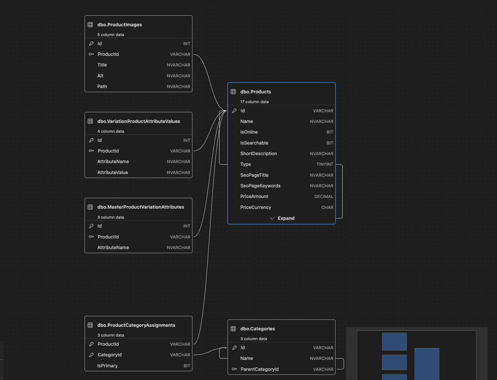
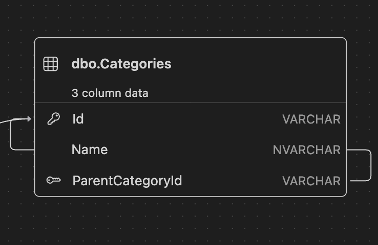
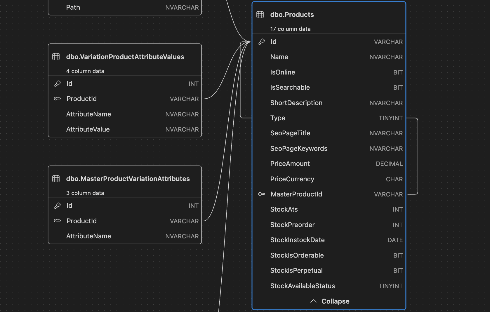
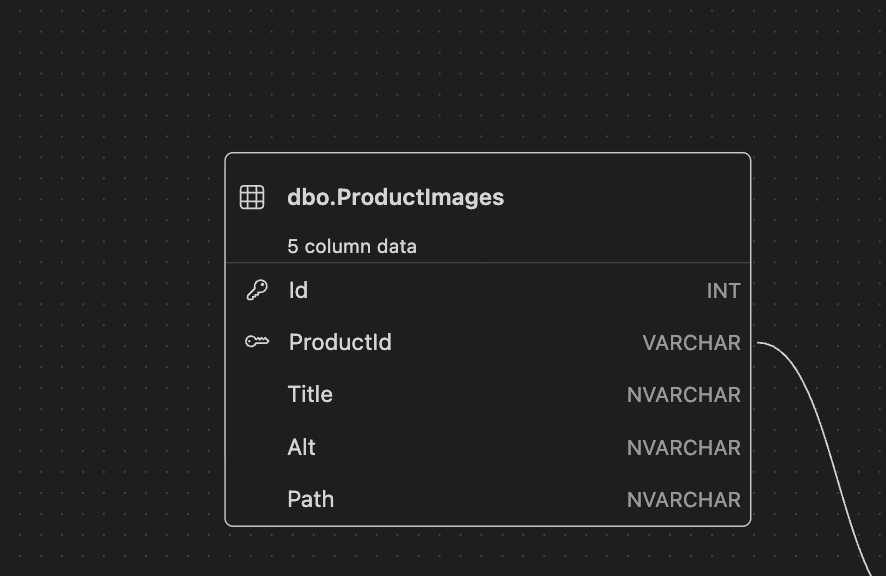
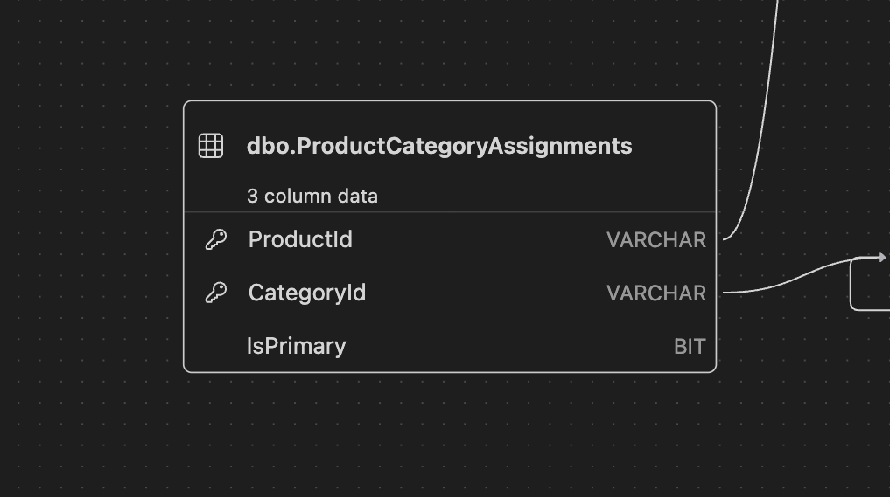

# Catalog Console App — Domain & Database Diagrams

This document collects the diagrams for each table/class in the catalog model,
plus one diagram showing how they all map together end to end.

Paste each diagram where indicated. If you're exporting images from VS Code,
save them under a `diagrams/` folder next to this README and reference them
with a relative path, e.g. ``.
Mermaid/PlantUML source blocks work too — just paste the code block in place
of the placeholder.

---

## Overall Mapping

_The full picture — how `Category`, `Product` (and its subtypes), and their
supporting tables relate to one another._

---

## Category

_`Categories` table — self-referencing tree via `ParentCategoryId`._

---

## Products (BaseProduct / MasterProduct / StandardProduct / VariationProduct)

_`Products` table — single table with a `Type` discriminator, plus the
self-referencing `MasterProductId` for variations._

---

## MasterProduct.VariationAttributes

_`MasterProductVariationAttributes` table — one row per attribute name a
master varies by (e.g. "Size")._

---

## VariationProduct.AttributeValues

_`VariationProductAttributeValues` table — one row per attribute name/value
pair for a given variation (e.g. "Size" → "48")._

---

## ProductImages

_`ProductImages` table — one product to many images._

---

## ProductCategoryAssignments

_`ProductCategoryAssignments` table — many-to-many join between products and
categories, with one `IsPrimary` flag per product._

---

## Notes / Open Questions

_