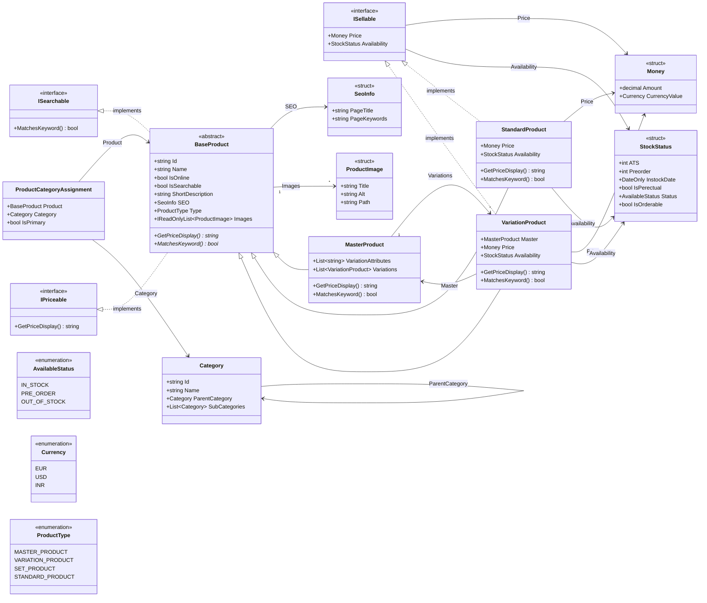

<!-- JOURNEY:START -->
<!-- Generated by tools/JourneyGen. Do not edit by hand: your changes will be overwritten. -->

## My .NET Journey

_A running record of the C# and .NET ground I have actually covered, generated from this repository on every push._

     

**Progress** `█████████████░░░░░░░` **65%**

Started 2026-08-08 · last commit 2026-09-18 · 7 active days

📊 **[Full dashboard with charts and timeline](https://yammanuresreekanth.github.io/csharp-mini-project/)**

### Domain model

_Generated from the source on every push — this diagram cannot drift from the code._

### Projects

| Project | Files | Lines | Types |
|---|---:|---:|---:|
| `Catalog.ConsoleApp` | 29 | 692 | 30 |
| `Ecom.MvcWebApp` | 3 | 64 | 2 |
| `Ecom.WebApiApp` | 1 | 42 | 1 |

### Who wrote this code

**100% of the application code is mine** — 634 of the 634 lines in it that anyone authored by hand.
A further 79 lines are `dotnet new` template output, which neither I nor an AI wrote.

| Project | Mine | AI | Scaffold | Share authored by me |
|---|---:|---:|---:|---|
| `Catalog.ConsoleApp` | 634 | 0 | 0 | `████████████████████` 100% |
| `Ecom.MvcWebApp` | 0 | 0 | 46 | — _template output only_ |
| `Ecom.WebApiApp` | 0 | 0 | 33 | — _template output only_ |
| **Application total** | **634** | **0** | **79** | `████████████████████` **100%** |

Separately, the tooling that generates this page is 1397 lines and **100% AI-written**. It is reported apart from the application figures rather than averaged into them, since it builds the page and is not part of the app:

| Tooling | Mine | AI | Share written by AI |
|---|---:|---:|---|
| `tools` | 0 | 1397 | `████████████████████` 100% |

How this is measured, and what is declared

Every non-blank line is attributed with `git blame` to the commit that last touched it,
and each commit is classified once. Lines count as mine by default — a line is only
AI or scaffold because a rule in `journey.json` says so. Edit a scaffold line and blame
reassigns it to me automatically, so the split cannot drift from the code.

Going forward this is automatic: any commit whose message carries an AI trailer
(`Co-Authored-By: Claude`, `Assisted-By: Claude`) has its lines counted as AI-written.

Commits counted as anything other than my own hand:

| Commit | Counted as | Subject |
|---|---|---|
| `00e0f1f` | AI | Add JourneyGen tool for analyzing C# source and git history |
| `d56cc61` | scaffold | Add initial setup for Ecom.WebApiApp including project file, HT… |

### Concepts covered

<b>C# fundamentals</b> — 9/12

- [x] **Classes** `Catalog.ConsoleApp/CustomAttributes/InfoAttribute.cs` +5
- [x] **Structs** — value types `Catalog.ConsoleApp/Domain/Structs/Money.cs` +3
- [x] **Enums** `Catalog.ConsoleApp/Domain/Enums/AvailableStatus.cs` +2
- [x] **Properties** `Catalog.ConsoleApp/CustomAttributes/InfoAttribute.cs` +5
- [x] **var / implicit typing** `Ecom.MvcWebApp/Program.cs` +1
- [x] **String interpolation** `Catalog.ConsoleApp/CustomExtensions/SqlDataReaderExtensions.cs` +3
- [x] **foreach** `Catalog.ConsoleApp/DataAccess/MySQLConnection.cs` +2
- [ ] switch
- [ ] Optional parameters
- [ ] out parameters
- [x] **params arrays** `Catalog.ConsoleApp/Logging/Logger.cs`
- [x] **Console I/O** `Catalog.ConsoleApp/CustomExtensions/SqlDataReaderExtensions.cs` +4

<b>Object-oriented design</b> — 8/15

- [x] **Interfaces** `Catalog.ConsoleApp/DataAccess/ICategoryRepository.cs` +4
- [x] **Inheritance** `Catalog.ConsoleApp/Domain/Classes/Product/MasterProduct.cs` +2
- [x] **Abstract classes** `Catalog.ConsoleApp/Domain/Classes/Product/BaseProduct.cs`
- [x] **Abstract members** `Catalog.ConsoleApp/Domain/Classes/Product/BaseProduct.cs`
- [x] **Overriding** `Catalog.ConsoleApp/Domain/Classes/Product/MasterProduct.cs` +2
- [ ] virtual members
- [ ] Default interface methods
- [x] **Static classes** `Catalog.ConsoleApp/CustomExtensions/SqlDataReaderExtensions.cs` +4
- [ ] Sealed classes
- [x] **Generics** `Catalog.ConsoleApp/DataAccess/CategoryRepository.cs` +5
- [x] **Generic types of my own** `Catalog.ConsoleApp/DataAccess/MySQLConnection.cs`
- [ ] Delegates
- [ ] Events
- [ ] Indexers
- [ ] Operator overloading

<b>Modern C#</b> — 12/17

- [x] **Records** `Ecom.WebApiApp/Program.cs`
- [x] **init-only properties** `Catalog.ConsoleApp/Domain/Classes/Category/Category.cs` +1
- [ ] required members
- [x] **Pattern matching** `Catalog.ConsoleApp/DataAccess/ProductRepository.cs` +2
- [ ] switch expressions
- [x] **Nullable reference types** `Catalog.ConsoleApp/CustomExtensions/SqlDataReaderExtensions.cs` +5
- [x] **?. and ?[]** `Catalog.ConsoleApp/CustomExtensions/SqlDataReaderExtensions.cs` +2
- [x] **?? and ??=** `Ecom.MvcWebApp/Controllers/HomeController.cs`
- [x] **Expression-bodied members** `Ecom.MvcWebApp/Models/ErrorViewModel.cs` +1
- [x] **Top-level statements** `Ecom.MvcWebApp/Program.cs` +1
- [x] **File-scoped namespaces** `Catalog.ConsoleApp/CustomExtensions/SqlDataReaderExtensions.cs` +4
- [x] **Target-typed new** `Catalog.ConsoleApp/DataAccess/MySQLConnection.cs`
- [ ] Collection expressions
- [ ] Primary constructors
- [ ] Tuples
- [x] **Lambdas** `Catalog.ConsoleApp/DataAccess/CategoryRepository.cs` +2
- [x] **Object initializers** `Catalog.ConsoleApp/DataAccess/CategoryRepository.cs` +3

<b>Collections & LINQ</b> — 3/6

- [x] **Generic collections** `Catalog.ConsoleApp/DataAccess/CategoryRepository.cs` +5
- [x] **LINQ** `Catalog.ConsoleApp/DataAccess/ProductRepository.cs` +1
- [x] **LINQ method syntax** `Catalog.ConsoleApp/DataAccess/ProductRepository.cs` +1
- [ ] LINQ query syntax
- [ ] Extension methods
- [ ] Iterators (yield)

<b>Errors, resources & async</b> — 6/10

- [x] **try / catch** `Catalog.ConsoleApp/DataAccess/MySQLConnection.cs`
- [x] **Throwing exceptions** `Catalog.ConsoleApp/DataAccess/CategoryRepository.cs` +4
- [x] **Custom exceptions** `Catalog.ConsoleApp/CustomExceptions/NoProductsFoundException.cs`
- [ ] Exception filters
- [ ] finally blocks
- [x] **using / IDisposable** `Catalog.ConsoleApp/DataAccess/MySQLConnection.cs` +1
- [x] **Custom attributes** `Catalog.ConsoleApp/CustomAttributes/InfoAttribute.cs`
- [x] **Logging** `Catalog.ConsoleApp/Logging/Logger.cs`
- [ ] async / await
- [ ] Task / ValueTask

<b>Data access</b> — 5/7

- [x] **ADO.NET** — raw SqlConnection / SqlDataReader `Catalog.ConsoleApp/DataAccess/MySQLConnection.cs`
- [x] **Hand-written SQL** `Catalog.ConsoleApp/Computation/Seed Data.sql` +4
- [x] **Repository pattern** `Catalog.ConsoleApp/DataAccess/CategoryRepository.cs` +3
- [x] **Factory pattern** `Catalog.ConsoleApp/Factories/CategoryFactory.cs` +1
- [x] **Service layer** `Catalog.ConsoleApp/Services/CatalogService.cs`
- [ ] EF Core — next up
- [ ] EF migrations — roadmap planned

<b>ASP.NET Core</b> — 8/10

- [x] **Dependency injection** `Ecom.MvcWebApp/Program.cs`
- [x] **Middleware pipeline** `Ecom.MvcWebApp/Program.cs` +1
- [x] **MVC controllers** `Ecom.MvcWebApp/Controllers/HomeController.cs`
- [x] **MVC routing** `Ecom.MvcWebApp/Program.cs`
- [x] **Razor views** `Ecom.MvcWebApp/Views`
- [x] **Static files** `Ecom.MvcWebApp/wwwroot`
- [x] **Minimal APIs** `Ecom.WebApiApp/Program.cs`
- [x] **OpenAPI / Swagger** `Ecom.WebApiApp/Program.cs`
- [ ] Configuration binding
- [ ] Authentication — roadmap planned

<b>Tooling & practice</b> — 2/5

- [x] **Multi-project solution** `csharp-ecom-mini-app.slnx`
- [x] **CI with GitHub Actions** `.github/workflows/journey.yml`
- [ ] Unit tests — roadmap
- [ ] Docker — roadmap
- [ ] Deployment — roadmap planned

Last updated 2026-09-18 08:47 UTC

<!-- JOURNEY:END -->

# Catalog Console App - Domain & Database Diagrams

This document collects the diagrams for each table/class in the catalog model,
plus one diagram showing how they all map together end to end.

---

## Overall Mapping

_The full picture - how `Category`, `Product` (and its subtypes), and their
supporting tables relate to one another._

---

## Category

_`Categories` table - self-referencing tree via `ParentCategoryId`._

---

## Products (BaseProduct / MasterProduct / StandardProduct / VariationProduct)

_`Products` table - single table with a `Type` discriminator, plus the
self-referencing `MasterProductId` for variations._

---

## MasterProduct.VariationAttributes

_`MasterProductVariationAttributes` table - one row per attribute name a
master varies by (e.g. "Size")._

---

## VariationProduct.AttributeValues

_`VariationProductAttributeValues` table - one row per attribute name/value
pair for a given variation (e.g. "Size" → "48")._

---

## ProductImages

_`ProductImages` table - one product to many images._

---

## ProductCategoryAssignments

_`ProductCategoryAssignments` table - many-to-many join between products and
categories, with one `IsPrimary` flag per product._

---

## Notes / Open Questions

_