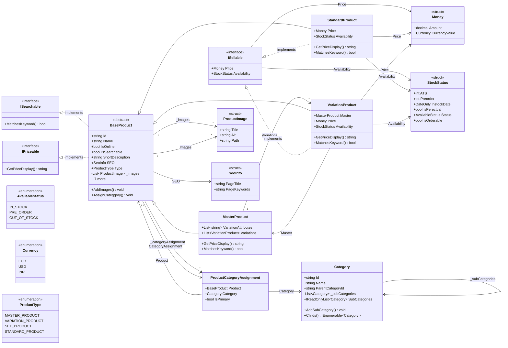

# my-apps

Personal .NET solutions workspace, tracked as one repo so the **.NET Journey** dashboard below covers everything I build, not just one project.

## Solutions

- [`csharp-mini-project/`](csharp-mini-project/README.MD) — e-commerce catalog domain: console app, MVC web app, Web API, tests
- [`Wishlist/`](Wishlist/) — wishlist service: Azure Functions, Core, Persistence

---

<!-- JOURNEY:START -->
<!-- Generated by tools/JourneyGen. Do not edit by hand: your changes will be overwritten. -->

## My .NET Journey

_A running record of the C# and .NET ground I have actually covered, generated from this repository on every push._

    

**Progress** `███████████████░░░░░` **76%**

📊 **[Full dashboard with charts and timeline](https://yammanuresreekanth.github.io/csharp-mini-project/)**

### Current focus

What I am working on right now · assigned 2026-09-22 · next review **2026-09-29**

`████████████████████` **4 of 4 complete** · 0 in progress

| Item | Status | Evidence in the code |
|---|---|---|
| DTOs and mapping services keeping the API contract separate from the domain model | ✅ Completed | ✓ `DTO types` Wishlist/src/Wishlist.Core/Contracts/ProductListDto.cs ✓ `Mapping service` Wishlist/src/Wishlist.Core/Contracts/ProductListMapper.cs |
| Bicep, deployments and Azure Functions one deployable slice: a Function provisioned with Bicep, using Azure SQL | ✅ Completed | ✓ `Bicep templates` Wishlist/Infra/main.bicep ✓ `Azure Function app` Wishlist/src/Wishlist.Functions/Functions/ProductListFunctions.cs ✓ `Azure SQL` Wishlist/Infra/modules/sql.bicep |
| Swagger the scaffold already emits an OpenAPI document; the rest is mine to add | ✅ Completed | ✓ `OpenAPI document` csharp-mini-project/Ecom.WebApiApp/Program.cs ✓ `Swagger UI` csharp-mini-project/Ecom.WebApiApp/Ecom.WebApiApp.csproj ✓ `Documented responses` csharp-mini-project/Ecom.WebApiApp/Controllers/ProductController.cs ✓ `XML comments in the docs` csharp-mini-project/Ecom.WebApiApp/Ecom.WebApiApp.csproj |
| Unit testing | ✅ Completed | ✓ `Test project` Wishlist/tests/Wishlist.Tests/Dummy.json ✓ `xUnit or NUnit` Wishlist/tests/Wishlist.Tests/Wishlist.Tests.csproj ✓ `Mocking` Wishlist/tests/Wishlist.Tests/ProductListServiceTests.cs ✓ `Running in CI` .githooks/pre-commit |

### Domain model

_Generated from the source on every push — this diagram cannot drift from the code._

```mermaid
classDiagram
    direction LR
    class IPriceable {
        <<interface>>
        +GetPriceDisplay() string
    }
    class ISearchable {
        <<interface>>
        +MatchesKeyword() bool
    }
    class ISellable {
        <<interface>>
        +Money Price
        +StockStatus Availability
    }
    class BaseProduct {
        <<abstract>>
        +string Id
        +string Name
        +bool IsOnline
        +bool IsSearchable
        +string ShortDescription
        +SeoInfo SEO
        +ProductType Type
        -List~ProductImage~ _images
        +AddImages() void
        +AssignCateggory() void
        ...7 more
    }
    class Category {
        +string Id
        +string Name
        +string ParentCategoryId
        -List~Category~ _subCategories
        +IReadOnlyList~Category~ SubCategories
        +AddSubCategory() void
        +Childs() IEnumerable~Category~
    }
    class MasterProduct {
        +List~string~ VariationAttributes
        +List~VariationProduct~ Variations
        +GetPriceDisplay() string
        +MatchesKeyword() bool
    }
    class Money {
        <<struct>>
        +decimal Amount
        +Currency CurrencyValue
    }
    class ProductCategoryAssignment {
        +BaseProduct Product
        +Category Category
        +bool IsPrimary
    }
    class ProductImage {
        <<struct>>
        +string Title
        +string Alt
        +string Path
    }
    class SeoInfo {
        <<struct>>
        +string PageTitle
        +string PageKeywords
    }
    class StandardProduct {
        +Money Price
        +StockStatus Availability
        +GetPriceDisplay() string
        +MatchesKeyword() bool
    }
    class StockStatus {
        <<struct>>
        +int ATS
        +int Preorder
        +DateOnly InstockDate
        +bool IsPerectual
        +AvailableStatus Status
        +bool IsOrderable
    }
    class VariationProduct {
        +MasterProduct Master
        +Money Price
        +StockStatus Availability
        +GetPriceDisplay() string
        +MatchesKeyword() bool
    }
    class AvailableStatus {
        <<enumeration>>
        IN_STOCK
        PRE_ORDER
        OUT_OF_STOCK
    }
    class Currency {
        <<enumeration>>
        EUR
        USD
        INR
    }
    class ProductType {
        <<enumeration>>
        MASTER_PRODUCT
        VARIATION_PRODUCT
        SET_PRODUCT
        STANDARD_PRODUCT
    }
    ISellable --> Money : Price
    ISellable --> StockStatus : Availability
    ISearchable <|.. BaseProduct : implements
    IPriceable <|.. BaseProduct : implements
    BaseProduct --> SeoInfo : SEO
    BaseProduct "1" --> "*" ProductImage : _images
    BaseProduct "1" --> "*" ProductCategoryAssignment : _categoryAssignment
    BaseProduct "1" --> "*" ProductImage : Images
    BaseProduct "1" --> "*" ProductCategoryAssignment : CategoryAssignment
    BaseProduct <|-- MasterProduct
    MasterProduct "1" --> "*" VariationProduct : Variations
    ProductCategoryAssignment --> BaseProduct : Product
    ProductCategoryAssignment --> Category : Category
    BaseProduct <|-- StandardProduct
    ISellable <|.. StandardProduct : implements
    StandardProduct --> Money : Price
    StandardProduct --> StockStatus : Availability
    BaseProduct <|-- VariationProduct
    ISellable <|.. VariationProduct : implements
    VariationProduct --> MasterProduct : Master
    VariationProduct --> Money : Price
    VariationProduct --> StockStatus : Availability
    Category --> Category : _subCategories
```

### Projects

| Project | Files | Lines | Types |
|---|---:|---:|---:|
| `Catalog.ConsoleApp` | 31 | 1060 | 32 |
| `Wishlist.Functions` | 9 | 908 | 8 |
| `Ecom.MvcWebApp` | 22 | 804 | 26 |
| `Ecom.WebApiApp` | 12 | 568 | 11 |
| `Wishlist.Core` | 11 | 293 | 16 |
| `Wishlist.Tests` | 1 | 119 | 1 |
| `Ecom.WebApiApp.Tests` | 1 | 99 | 1 |

### Who wrote this code

**100% of the application code is mine** — 3107 of the 3107 lines in it that anyone authored by hand.
A further 55 lines are `dotnet new` template output, which neither I nor an AI wrote.

| Project | Mine | AI | Scaffold | Share authored by me |
|---|---:|---:|---:|---|
| `Catalog.ConsoleApp` | 867 | 0 | 0 | `████████████████████` 100% |
| `Wishlist.Functions` | 749 | 0 | 0 | `████████████████████` 100% |
| `Ecom.MvcWebApp` | 606 | 0 | 46 | `████████████████████` 100% |
| `Ecom.WebApiApp` | 470 | 0 | 9 | `████████████████████` 100% |
| `Wishlist.Core` | 244 | 0 | 0 | `████████████████████` 100% |
| `Wishlist.Tests` | 91 | 0 | 0 | `████████████████████` 100% |
| `Ecom.WebApiApp.Tests` | 80 | 0 | 0 | `████████████████████` 100% |
| **Application total** | **3107** | **0** | **55** | `████████████████████` **100%** |

How this is measured, and what is declared

Every non-blank line is attributed with `git blame` to the commit that last touched it,
and each commit is classified once. Lines count as mine by default — a line is only
AI or scaffold because a rule in `journey.json` says so. Edit a scaffold line and blame
reassigns it to me automatically, so the split cannot drift from the code.

Going forward this is automatic: any commit whose message carries an AI trailer
(`Co-Authored-By: Claude`, `Assisted-By: Claude`) has its lines counted as AI-written.

The AI-written tooling totals and the commit-by-commit audit trail, with a link to
each declared commit, are on the dashboard under **How this is measured**.

### .NET backend engineering skills

_The ground I want to cover for my career in .NET._

`███████░░░░░░░░░░░░░` **58 of 178 covered** across 14 areas

The long-range picture. Most of it is untouched, which is the point — it shows the scope and where I am in it. Items marked not code-detectable are judgement topics no detector can honestly prove.

| Area | Covered | |
|---|---:|---|
| C# and modern .NET depth | 15/22 | `██████████████░░░░░░` 68% |
| ASP.NET Core Web APIs | 6/14 | `█████████░░░░░░░░░░░` 43% |
| Domain-Driven Design | 4/10 | `████████░░░░░░░░░░░░` 40% |
| Microservices architecture | 0/11 | `░░░░░░░░░░░░░░░░░░░░` 0% |
| Event-driven architecture and messaging | 0/13 | `░░░░░░░░░░░░░░░░░░░░` 0% |
| Azure cloud services | 2/10 | `████░░░░░░░░░░░░░░░░` 20% |
| Infrastructure as Code (Bicep) | 12/20 | `████████████░░░░░░░░` 60% |
| Databases and data modeling | 5/11 | `█████████░░░░░░░░░░░` 45% |
| Testing and code quality | 3/11 | `█████░░░░░░░░░░░░░░░` 27% |
| CI/CD and DevOps basics | 5/12 | `████████░░░░░░░░░░░░` 42% |
| Integrations with external systems | 0/13 | `░░░░░░░░░░░░░░░░░░░░` 0% |
| Observability and production readiness | 3/13 | `█████░░░░░░░░░░░░░░░` 23% |
| Security basics | 2/10 | `████░░░░░░░░░░░░░░░░` 20% |
| AI-assisted development | 1/8 | `██░░░░░░░░░░░░░░░░░░` 12% |

<b>C# and modern .NET depth</b> — 15/22 · Strong enough that C# feels natural.

- [x] **Classes and interfaces** `Wishlist/src/Wishlist.Core/Contracts/ProductListDto.cs` +3
- [x] **Records** `Wishlist/src/Wishlist.Core/Contracts/Requests.cs`
- [x] **Generics** `Wishlist/src/Wishlist.Core/Contracts/ProductListWithItemsDto.cs` +3
- [ ] Delegates and events
- [x] **LINQ** `Wishlist/src/Wishlist.Functions/Repositories/ProductListRepository.cs` +3
- [x] **async / await / Task** `Wishlist/src/Wishlist.Core/Interfaces/IProductListRepository.cs` +3
- [x] **Cancellation tokens** `Wishlist/src/Wishlist.Core/Interfaces/IProductListRepository.cs` +3
- [ ] Parallelism
- [x] **Dependency injection** `Wishlist/src/Wishlist.Functions/Program.cs` +2
- [x] **Configuration** `csharp-mini-project/Ecom.MvcWebApp/Program.cs` +1
- [x] **Error handling** `Wishlist/src/Wishlist.Functions/Functions/Http.cs` +3
- [x] **Logging** `Wishlist/src/Wishlist.Functions/Functions/ProductListFunctions.cs` +3
- [x] **Validation** `csharp-mini-project/Ecom.MvcWebApp/Controllers/EmployeesController.cs` +3
- [ ] SOLID principles — judgement, not detectable judgement — not code-detectable
- [ ] Clean code — judgement, not detectable judgement — not code-detectable
- [ ] Garbage collection basics — judgement, not detectable judgement — not code-detectable
- [x] **Value vs reference types** `Wishlist/src/Wishlist.Core/Contracts/ProductListDto.cs` +3
- [x] **IDisposable** `csharp-mini-project/Catalog.ConsoleApp/DataAccess/CategoryRepository.cs` +3
- [x] **.NET 8/9 app structure** `Wishlist/src/Wishlist.Core/Wishlist.Core.csproj` +3
- [ ] Minimal APIs
- [x] **ASP.NET Core Web APIs** `csharp-mini-project/Ecom.MvcWebApp/Ecom.MvcWebApp.csproj` +1
- [ ] Build and explain a production-style API — the real bar for this area judgement — not code-detectable

<b>ASP.NET Core Web APIs</b> — 6/14 · Central to the role.

- [ ] REST API design judgement — not code-detectable
- [x] **Controllers** `csharp-mini-project/Ecom.MvcWebApp/Controllers/CategoryController.cs` +3
- [ ] Minimal APIs
- [x] **Middleware pipeline** `csharp-mini-project/Ecom.MvcWebApp/Program.cs` +1
- [x] **Custom middleware** `csharp-mini-project/Ecom.MvcWebApp/Middlewares/RequestLogging.cs` +1
- [ ] Authentication
- [ ] Authorization
- [x] **Model binding and validation** `csharp-mini-project/Ecom.MvcWebApp/Controllers/EmployeesController.cs` +1
- [ ] API versioning
- [x] **Swagger / OpenAPI** `csharp-mini-project/Ecom.WebApiApp/Program.cs`
- [x] **Structured error responses** `csharp-mini-project/Ecom.WebApiApp/Controllers/ProductController.cs`
- [ ] Health checks
- [ ] Rate limiting
- [ ] Resilience

<b>Domain-Driven Design</b> — 4/10 · Explicitly named in the role.

- [x] **Entities and value objects** `csharp-mini-project/Catalog.ConsoleApp/Domain/Classes/Category/Category.cs` +3
- [ ] Aggregates and aggregate roots
- [x] **Repositories** `Wishlist/src/Wishlist.Core/Interfaces/IProductListRepository.cs` +3
- [x] **Factories** `csharp-mini-project/Catalog.ConsoleApp/Factories/CategoryFactory.cs` +1
- [ ] Domain events
- [ ] Specification pattern
- [ ] Bounded contexts judgement — not code-detectable
- [ ] Ubiquitous language judgement — not code-detectable
- [x] **Application vs domain layer** `csharp-mini-project/Catalog.ConsoleApp/Domain/Classes/Category/Category.cs` +3
- [ ] Practice project: tailoring order management — orders, measurements, alterations, payments, shipping judgement — not code-detectable

<b>Microservices architecture</b> — 0/11 · Know when they help and when they cost.

- [ ] Service boundaries judgement — not code-detectable
- [ ] Database-per-service judgement — not code-detectable
- [ ] API gateway basics judgement — not code-detectable
- [ ] Synchronous vs asynchronous communication judgement — not code-detectable
- [ ] Service discovery judgement — not code-detectable
- [ ] Distributed transactions judgement — not code-detectable
- [ ] Saga pattern
- [ ] Idempotency
- [ ] Eventual consistency judgement — not code-detectable
- [ ] Observability across services judgement — not code-detectable
- [ ] Knowing when not to split — the answer they want to hear in interviews judgement — not code-detectable

<b>Event-driven architecture and messaging</b> — 0/13 · One of the biggest topics for the role.

- [ ] Queues vs topics judgement — not code-detectable
- [ ] Commands vs events judgement — not code-detectable
- [ ] Publish / subscribe judgement — not code-detectable
- [ ] Azure Service Bus queues
- [ ] Azure Service Bus topics
- [ ] Dead-letter queues
- [ ] Retries
- [ ] Poison messages judgement — not code-detectable
- [ ] Idempotent message handling
- [ ] Outbox pattern
- [ ] Message ordering
- [ ] Duplicate detection
- [ ] OrderCreated fan-out scenario — inventory, payments, warehouse, email, CRM react independently

<b>Azure cloud services</b> — 2/10 · The services named on the profile.

- [x] **Azure App Service** `Wishlist/Infra/modules/functionapp.bicep`
- [x] **Azure Functions** `Wishlist/src/Wishlist.Functions/Functions/ProductListFunctions.cs` +2
- [ ] Azure Service Bus
- [ ] Azure Cosmos DB
- [ ] Azure Table Storage
- [ ] Azure Storage Accounts
- [ ] Application Insights
- [ ] Azure Key Vault
- [ ] Azure Monitor judgement — not code-detectable
- [ ] Managed identities

<b>Infrastructure as Code (Bicep)</b> — 12/20 · Declaring the whole backend, not clicking it together in the portal.

- [x] **Bicep templates** `Wishlist/Infra/main.bicep` +3
- [x] **Resource declarations** `Wishlist/Infra/main.bicep` +3
- [x] **targetScope and resource groups** `Wishlist/Infra/main.bicep` +3
- [x] **Parameters** `Wishlist/Infra/main.bicep` +3
- [ ] Parameter files (.bicepparam)
- [ ] Decorators — @description, @allowed, @secure
- [ ] Variables and expressions
- [x] **Modules** — composing templates instead of one long file `Wishlist/Infra/main.bicep`
- [x] **Outputs** `Wishlist/Infra/main.bicep` +3
- [x] **Referencing existing resources** `Wishlist/Infra/modules/functionapp.bicep`
- [x] **Deploying App Service** `Wishlist/Infra/modules/functionapp.bicep`
- [x] **Deploying Azure Functions** `Wishlist/Infra/modules/functionapp.bicep`
- [ ] Deploying Service Bus
- [ ] Deploying Cosmos DB
- [ ] Deploying Key Vault and secrets
- [x] **Managed identity and RBAC in Bicep** `Wishlist/Infra/modules/functionapp.bicep`
- [x] **Environment-specific configuration** — one template, parameterised per environment `Wishlist/Infra/main.bicep` +3
- [ ] Linting and bicep build
- [ ] Previewing with what-if — see the change before it lands
- [x] **Deploying from CI** `.github/workflows/_dotnet-functions.yml`

<b>Databases and data modeling</b> — 5/11 · Relational and NoSQL thinking.

- [x] **SQL Server basics** `Wishlist/Infra/modules/functionapp.bicep` +3
- [x] **Hand-written SQL** `csharp-mini-project/Catalog.ConsoleApp/Computation/Reset catalog schema.SQL` +3
- [x] **Entity Framework Core** `Wishlist/src/Wishlist.Functions/Data/WishlistDbContext.cs` +3
- [x] **Migrations** `Wishlist/src/Wishlist.Functions/Migrations/20260926135834_InitialCreate.Designer.cs` +3
- [x] **Indexing** `Wishlist/src/Wishlist.Functions/Migrations/20260926135834_InitialCreate.Designer.cs` +3
- [ ] Transactions
- [ ] Optimistic concurrency
- [ ] Cosmos DB partition keys — poor choices are expensive and hard to undo
- [ ] Document modeling judgement — not code-detectable
- [ ] Table Storage design
- [ ] Relational vs NoSQL choice judgement — not code-detectable

<b>Testing and code quality</b> — 3/11 · Called out in the job description.

- [x] **xUnit or NUnit** `Wishlist/tests/Wishlist.Tests/Wishlist.Tests.csproj` +1
- [x] **Unit tests** `Wishlist/tests/Wishlist.Tests/ProductListServiceTests.cs` +1
- [x] **Mocking** `Wishlist/tests/Wishlist.Tests/ProductListServiceTests.cs` +3
- [ ] Integration testing
- [ ] Testing APIs judgement — not code-detectable
- [ ] Testing message handlers judgement — not code-detectable
- [ ] Contract testing
- [ ] Testcontainers
- [ ] Clean architecture testability judgement — not code-detectable
- [ ] Code review principles judgement — not code-detectable
- [ ] Explaining what you do not test, and why judgement — not code-detectable

<b>CI/CD and DevOps basics</b> — 5/12 · They expect pipeline improvements.

- [x] **Git fundamentals** `.gitignore` +2
- [ ] Branching strategies judgement — not code-detectable
- [ ] Pull requests judgement — not code-detectable
- [x] **Build pipelines** `.github/workflows/_dotnet-functions.yml` +3
- [x] **GitHub Actions** `.github/workflows/_dotnet-functions.yml` +3
- [x] **Automated tests in CI** `.githooks/pre-commit` +2
- [ ] Static analysis
- [x] **Secrets management** `.github/workflows/_dotnet-functions.yml`
- [ ] Release pipelines judgement — not code-detectable
- [ ] Environment promotion — dev, test, staging, production judgement — not code-detectable
- [ ] Rollback strategies judgement — not code-detectable
- [ ] Blue-green or slot deployments judgement — not code-detectable

<b>Integrations with external systems</b> — 0/13 · Salesforce, Dynamics, WMS, POS, OMS, WeChat.

- [ ] REST integrations
- [ ] Typed API clients
- [ ] Webhooks
- [ ] Authenticating with external APIs judgement — not code-detectable
- [ ] OAuth basics
- [ ] Retry policies
- [ ] Circuit breakers
- [ ] Rate limits
- [ ] Data mapping
- [ ] Anti-corruption layer judgement — not code-detectable
- [ ] Integration events
- [ ] Reconciliation jobs judgement — not code-detectable
- [ ] Handling partial failure judgement — not code-detectable

<b>Observability and production readiness</b> — 3/13 · “It works locally” is not enough.

- [x] **Structured logging** `Wishlist/src/Wishlist.Functions/Functions/ProductListFunctions.cs` +3
- [x] **Correlation IDs** `csharp-mini-project/Ecom.MvcWebApp/Controllers/HomeController.cs`
- [x] **Distributed tracing** `Wishlist/src/Wishlist.Functions/Program.cs` +2
- [ ] Metrics
- [ ] Application Insights
- [ ] Health checks
- [ ] Dashboards judgement — not code-detectable
- [ ] Alerts judgement — not code-detectable
- [ ] Performance monitoring judgement — not code-detectable
- [ ] Exception tracking judgement — not code-detectable
- [ ] Diagnosing slow APIs judgement — not code-detectable
- [ ] Diagnosing failed messages judgement — not code-detectable
- [ ] Answering “how would you know this is healthy in production?” judgement — not code-detectable

<b>Security basics</b> — 2/10 · Production awareness, not specialism.

- [ ] OAuth2 / OpenID Connect
- [ ] JWT tokens
- [ ] Role-based authorization
- [ ] Secrets in Key Vault
- [ ] Managed identities
- [x] **HTTPS** `csharp-mini-project/Ecom.MvcWebApp/Program.cs` +1
- [x] **Input validation** `csharp-mini-project/Ecom.MvcWebApp/Controllers/EmployeesController.cs` +3
- [ ] OWASP Top 10 basics judgement — not code-detectable
- [ ] Secure API design judgement — not code-detectable
- [ ] Least privilege access judgement — not code-detectable

<b>AI-assisted development</b> — 1/8 · Use it professionally, not blindly.

- [ ] Generate boilerplate faster judgement — not code-detectable
- [ ] Refactor code with review judgement — not code-detectable
- [ ] Write tests with AI judgement — not code-detectable
- [ ] Explain unfamiliar code judgement — not code-detectable
- [ ] Generate infrastructure templates judgement — not code-detectable
- [ ] Improve documentation judgement — not code-detectable
- [ ] Validate AI output through tests and review judgement — not code-detectable
- [x] **Declaring AI authorship honestly** — the provenance tracking in this repo `journey.json`

### Concepts covered

<b>C# fundamentals</b> — 9/12

- [x] **Classes** `Wishlist/src/Wishlist.Core/Contracts/ProductListDto.cs` +5
- [x] **Structs** — value types `csharp-mini-project/Catalog.ConsoleApp/Domain/Structs/Money.cs` +3
- [x] **Enums** `Wishlist/src/Wishlist.Core/Enums/ProductListType.cs` +3
- [x] **Properties** `Wishlist/src/Wishlist.Core/Contracts/ProductListDto.cs` +5
- [x] **var / implicit typing** `csharp-mini-project/Ecom.MvcWebApp/Controllers/LinqController.cs` +1
- [x] **String interpolation** `Wishlist/src/Wishlist.Core/Exceptions/ProductListNotFoundException.cs` +5
- [x] **foreach** `Wishlist/src/Wishlist.Core/Contracts/ProductListMapper.cs` +5
- [ ] switch
- [ ] Optional parameters
- [ ] out parameters
- [x] **params arrays** `csharp-mini-project/Catalog.ConsoleApp/Logging/Logger.cs`
- [x] **Console I/O** `csharp-mini-project/Catalog.ConsoleApp/AsyncProgram.cs` +5

<b>Object-oriented design</b> — 8/15

- [x] **Interfaces** `Wishlist/src/Wishlist.Core/Interfaces/IProductListRepository.cs` +5
- [x] **Inheritance** `Wishlist/src/Wishlist.Core/Contracts/ProductListWithItemsDto.cs` +3
- [x] **Abstract classes** `csharp-mini-project/Catalog.ConsoleApp/Domain/Classes/Product/BaseProduct.cs`
- [x] **Abstract members** `csharp-mini-project/Catalog.ConsoleApp/Domain/Classes/Product/BaseProduct.cs`
- [x] **Overriding** `Wishlist/src/Wishlist.Functions/Migrations/20260926135834_InitialCreate.Designer.cs` +5
- [ ] virtual members
- [ ] Default interface methods
- [x] **Static classes** `Wishlist/src/Wishlist.Core/Contracts/ProductListMapper.cs` +5
- [ ] Sealed classes
- [x] **Generics** `Wishlist/src/Wishlist.Core/Contracts/ProductListWithItemsDto.cs` +5
- [x] **Generic types of my own** `csharp-mini-project/Catalog.ConsoleApp/DataAccess/MySQLAsyncConnection.cs` +2
- [ ] Delegates
- [ ] Events
- [ ] Indexers
- [ ] Operator overloading

<b>Modern C#</b> — 15/17

- [x] **Records** `Wishlist/src/Wishlist.Core/Contracts/Requests.cs`
- [x] **init-only properties** `csharp-mini-project/Catalog.ConsoleApp/Domain/Classes/Category/Category.cs` +1
- [x] **required members** `Wishlist/src/Wishlist.Core/Contracts/ProductListItemDto.cs` +2
- [x] **Pattern matching** `csharp-mini-project/Catalog.ConsoleApp/DataAccess/ProductRepository.cs` +5
- [ ] switch expressions
- [x] **Nullable reference types** `Wishlist/src/Wishlist.Core/Contracts/ProductListMapper.cs` +5
- [x] **?. and ?[]** `csharp-mini-project/Catalog.ConsoleApp/CustomExtensions/SqlDataReaderExtensions.cs` +4
- [x] **?? and ??=** `csharp-mini-project/Ecom.MvcWebApp/Controllers/HomeController.cs`
- [x] **Expression-bodied members** `Wishlist/src/Wishlist.Functions/Functions/ProductListFunctions.cs` +4
- [x] **Top-level statements** `Wishlist/src/Wishlist.Functions/Program.cs` +2
- [x] **File-scoped namespaces** `Wishlist/src/Wishlist.Core/Contracts/ProductListDto.cs` +5
- [x] **Target-typed new** `Wishlist/src/Wishlist.Core/Contracts/ProductListWithItemsDto.cs` +3
- [x] **Collection expressions** `Wishlist/src/Wishlist.Core/Entities/ProductList.cs` +1
- [x] **Primary constructors** `Wishlist/src/Wishlist.Core/Exceptions/ProductListNotFoundException.cs` +5
- [ ] Tuples
- [x] **Lambdas** `Wishlist/src/Wishlist.Functions/Functions/ProductListFunctions.cs` +5
- [x] **Object initializers** `Wishlist/src/Wishlist.Core/Contracts/ProductListMapper.cs` +5

<b>Collections & LINQ</b> — 7/9

- [x] **Generic collections** `Wishlist/src/Wishlist.Core/Contracts/ProductListWithItemsDto.cs` +5
- [x] **LINQ** `Wishlist/src/Wishlist.Functions/Repositories/ProductListRepository.cs` +5
- [x] **LINQ method syntax** `Wishlist/src/Wishlist.Functions/Repositories/ProductListRepository.cs` +5
- [ ] LINQ query syntax
- [ ] Extension methods
- [x] **Iterators (yield)** `csharp-mini-project/Catalog.ConsoleApp/Domain/Classes/Category/Category.cs`
- [x] **IEnumerable<T>** `csharp-mini-project/Catalog.ConsoleApp/Domain/Classes/Category/Category.cs` +4
- [x] **IList<T>** `csharp-mini-project/Catalog.ConsoleApp/Domain/Classes/Product/BaseProduct.cs`
- [x] **IReadOnlyList<T>** `Wishlist/src/Wishlist.Core/Interfaces/IProductListRepository.cs` +5

<b>Errors, resources & async</b> — 11/13

- [x] **try / catch** `Wishlist/src/Wishlist.Functions/Functions/Http.cs` +5
- [x] **Throwing exceptions** `csharp-mini-project/Catalog.ConsoleApp/DataAccess/CategoryRepository.cs` +5
- [x] **Custom exceptions** `Wishlist/src/Wishlist.Core/Exceptions/ProductListNotFoundException.cs` +1
- [ ] Exception filters
- [ ] finally blocks
- [x] **using / IDisposable** `csharp-mini-project/Catalog.ConsoleApp/AsyncProgram.cs` +5
- [x] **Custom attributes** `csharp-mini-project/Catalog.ConsoleApp/CustomAttributes/InfoAttribute.cs`
- [x] **Logging** `Wishlist/src/Wishlist.Functions/Functions/ProductListFunctions.cs` +5
- [x] **async / await** `Wishlist/src/Wishlist.Functions/Functions/Http.cs` +5
- [x] **Task / ValueTask** `Wishlist/src/Wishlist.Core/Interfaces/IProductListRepository.cs` +5
- [x] **ILogger** `Wishlist/src/Wishlist.Functions/Functions/ProductListFunctions.cs` +5
- [x] **Structured logging** `Wishlist/src/Wishlist.Functions/Functions/ProductListFunctions.cs` +4
- [x] **IDisposable implemented** `csharp-mini-project/Catalog.ConsoleApp/DataAccess/CategoryRepository.cs` +3

<b>Data access</b> — 7/7

- [x] **ADO.NET** — raw SqlConnection / SqlDataReader `csharp-mini-project/Catalog.ConsoleApp/DataAccess/MySQLAsyncConnection.cs` +1
- [x] **Hand-written SQL** `csharp-mini-project/Catalog.ConsoleApp/Computation/Reset catalog schema.SQL` +4
- [x] **Repository pattern** `Wishlist/src/Wishlist.Core/Interfaces/IProductListRepository.cs` +5
- [x] **Factory pattern** `csharp-mini-project/Catalog.ConsoleApp/Factories/CategoryFactory.cs` +1
- [x] **Service layer** `Wishlist/src/Wishlist.Core/Interfaces/IProductListService.cs` +3
- [x] **EF Core** — next up `Wishlist/src/Wishlist.Functions/Data/WishlistDbContext.cs` +5
- [x] **EF migrations** `Wishlist/src/Wishlist.Functions/Migrations/20260926135834_InitialCreate.Designer.cs` +5

<b>ASP.NET Core</b> — 11/13

- [x] **Dependency injection** `Wishlist/src/Wishlist.Functions/Program.cs` +2
- [x] **Middleware pipeline** `csharp-mini-project/Ecom.MvcWebApp/Program.cs` +1
- [x] **MVC controllers** `csharp-mini-project/Ecom.MvcWebApp/Controllers/CategoryController.cs` +5
- [x] **MVC routing** `csharp-mini-project/Ecom.MvcWebApp/Program.cs` +1
- [x] **Razor views** `csharp-mini-project/Ecom.MvcWebApp/Views`
- [x] **Static files** `csharp-mini-project/Ecom.MvcWebApp/wwwroot`
- [ ] Minimal APIs
- [x] **OpenAPI / Swagger** `csharp-mini-project/Ecom.WebApiApp/Program.cs`
- [x] **Configuration binding** `csharp-mini-project/Ecom.MvcWebApp/Program.cs` +1
- [ ] Authentication
- [x] **IoC container** `csharp-mini-project/Ecom.MvcWebApp/Program.cs`
- [x] **DI lifetimes** — scoped / singleton / transient `Wishlist/src/Wishlist.Functions/Program.cs` +2
- [x] **Custom middleware** `csharp-mini-project/Ecom.MvcWebApp/Middlewares/RequestLogging.cs`

<b>Messaging & integration</b> — 0/3

- [ ] Azure Service Bus
- [ ] HttpClient
- [ ] Background services

<b>Tooling & practice</b> — 3/5

- [x] **Multi-project solution** `Wishlist/Wishlist.slnx` +1
- [x] **CI with GitHub Actions** `.github/workflows/_dotnet-functions.yml` +3
- [x] **Unit tests** — roadmap `Wishlist/tests/Wishlist.Tests/ProductListServiceTests.cs` +1
- [ ] Docker — roadmap
- [ ] Deployment — roadmap planned

Last updated 2026-09-28 13:45 UTC

<!-- JOURNEY:END -->
