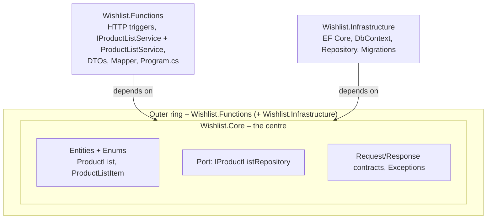
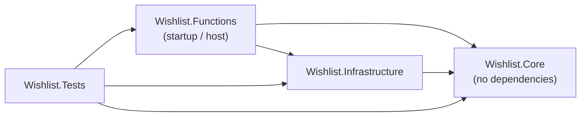
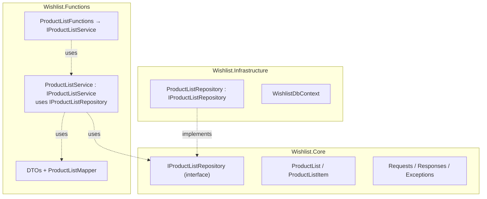
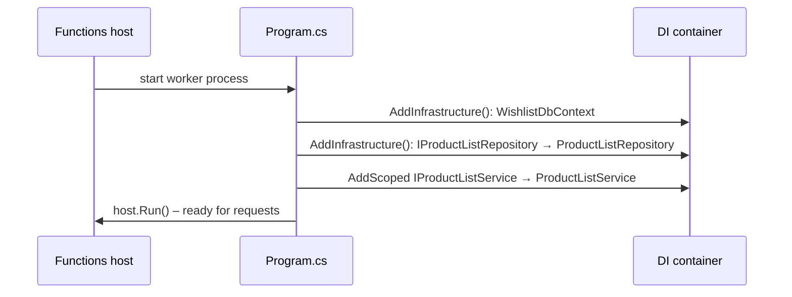
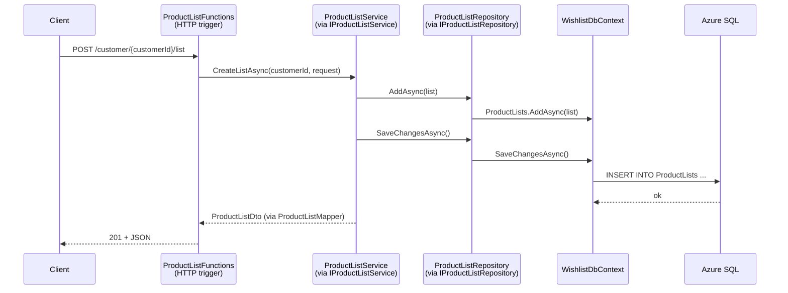
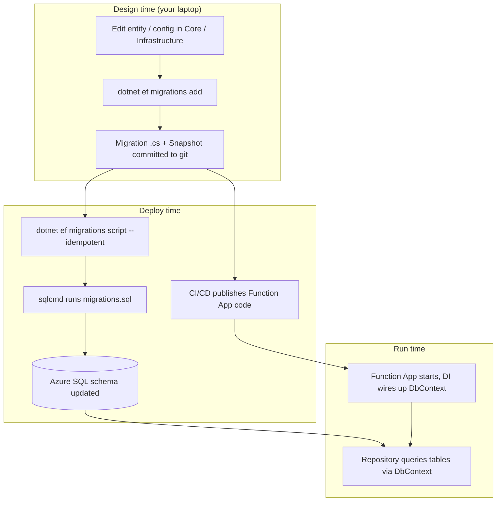

# Wishlist – Architecture Guide

A short guide to how the solution is layered, how the pieces connect at **compile time** and **run time**, and how **EF Core migrations** fit in.

Diagrams are [Mermaid](https://mermaid.js.org/) – they render on GitHub and in VS Code (Markdown Preview Mermaid Support extension).

---

## 1. Does it follow Onion Architecture?

**Mostly yes, with one deviation.**

Onion rule: *dependencies point inward only*. The centre (domain) knows nothing about the outside world.



### Project map

| Project | Role | References |
|---|---|---|
| `Wishlist.Core` | Entities, enums, `IProductListRepository`, request/response contracts, exceptions. **No NuGet packages, no project references.** | nothing |
| `Wishlist.Infrastructure` | EF Core `WishlistDbContext`, entity configurations, `ProductListRepository`, migrations, `AddInfrastructure()` | Core |
| `Wishlist.Functions` | Azure Functions HTTP endpoints, `IProductListService` + `ProductListService`, DTOs, `ProductListMapper`, `Program.cs` (composition root) | Core, Infrastructure |
| `Wishlist.Tests` | xUnit + Moq tests | all three |

### What is correct

- **Core has zero dependencies.** It is the only project that can be understood in isolation.
- **Dependency inversion is done properly where it matters.** Core *defines* `IProductListRepository`; Infrastructure *implements* it. The service depends on the interface, never on EF Core.
- **Core is now a pure domain core.** DTOs, the mapper and `IProductListService` moved out to Functions, so Core only holds the domain model and the persistence port.
- **EF Core is hidden in Infrastructure.** Entities are plain C# classes; mapping lives in `IEntityTypeConfiguration` classes, not attributes on entities.
- **`Program.cs` is the composition root.** It is the one place that knows which concrete class backs which interface.

### Where it deviates (worth knowing, not necessarily wrong)

| # | Observation | Why it matters |
|---|---|---|
| 1 | `ProductListService` (business logic), `IProductListService`, DTOs and the mapper all live in **`Wishlist.Functions`**, the outermost ring. | Moving them out made Core cleaner, but strictly speaking the *use-case/application layer* now sits in the host. In classic Onion/Clean Architecture it would sit in its own ring between Core and the outside (e.g. `Wishlist.Application`). Trade-off: simple, fewer projects, but logic can't be reused by another host (worker, console) without referencing Functions. Fine for a single-host app. |
| 2 | `Core/Contracts/Requests.cs` and `Responses.cs` are still in Core. | They are HTTP-shaped types (request bodies, `ErrorResponse`), and the service in Functions is their only real consumer. They fit better next to the DTOs in Functions. Not a rule break, but the inner ring knows about the API's shape. |
| 3 | `Wishlist.Functions` also references **EF Core packages** (`SqlServer`, `Design`, `Tools`) directly. | Needed so `dotnet ef` can use Functions as the *startup project*. Harmless, but the Functions layer can now "see" EF types. |
| 4 | `Functions` → `Infrastructure` is a **direct project reference**. | Acceptable for a composition root (it must call `AddInfrastructure`). Just keep endpoints/services from using Infrastructure types. |
| 5 | Small naming slips: folder `Persistance` vs namespace `Persistence`; `DesignTimeDbContextFactory` lives in Infrastructure but its namespace is `Wishlist.Functions`. | Cosmetic, but confusing when searching. |

---|---|---|
| 1 | `ProductListService` (business logic) lives in **`Wishlist.Functions/Services`**, not in Core or an Application project. | In classic Onion, use-case logic sits in an inner ring. Here it sits in the outermost ring, so it can't be reused by another host (a worker, a console tool) without referencing the Functions project. Moving it to Core (or a new `Wishlist.Application`) would fix it. |
| 2 | `Wishlist.Functions` also references **EF Core packages** (`SqlServer`, `Design`, `Tools`) directly. | Needed so `dotnet ef` can use Functions as the *startup project*. Harmless, but the Functions layer can now "see" EF types. |
| 3 | `Functions` → `Infrastructure` is a **direct project reference**. | Acceptable for a composition root (it must call `AddInfrastructure`). Just keep endpoints/services from using Infrastructure types. |
| 4 | Small naming slips: folder `Persistance` vs namespace `Persistence`; `DesignTimeDbContextFactory` lives in Infrastructure but its namespace is `Wishlist.Functions`. | Cosmetic, but confusing when searching. |

---

## 2. Compile time – who references whom

At compile time only the **project references** (`.csproj`) matter. This is the "static" picture.



Reading it: arrows = "can use types from". **Nothing points out of Core.** If you ever add an arrow from Core to another project, the architecture is broken.

What each project *compiles against*:



Note: `ProductListFunctions` and `ProductListService` never mention `ProductListRepository` or `WishlistDbContext`. The only persistence abstraction they know is `IProductListRepository` from Core. `IProductListService` is now *inside* Functions, so the endpoint-to-service link is an internal seam (still useful for mocking in tests), not a layer boundary.

---

## 3. Run time – how the interfaces get real classes

The interfaces are glued to implementations **when the app starts**, by dependency injection (DI) in `Program.cs`:

```csharp
services.AddInfrastructure(context.Configuration);          // registers WishlistDbContext + IProductListRepository → ProductListRepository
services.AddScoped<IProductListService, ProductListService>();
```

`AddInfrastructure` ([DependencyInjection.cs](src/Wishlist.Infrastructure/DependencyInjection.cs)) reads the `SqlConnectionString` setting and registers `WishlistDbContext` (SQL Server) and the repository.

### Startup (once)



### One HTTP request (every call)



`AddScoped` means: one instance of the service/repository/DbContext **per request**, all sharing the same `WishlistDbContext`, so `SaveChangesAsync` commits everything that was tracked in that request.

### Compile time vs run time in one table

| | Compile time | Run time |
|---|---|---|
| Decided by | `.csproj` `ProjectReference`s | DI registrations in `Program.cs` / `AddInfrastructure` |
| Question answered | "Which code *may* use which code?" | "Which concrete class *actually* gets used?" |
| Functions ↔ Repository | Functions only sees `IProductListRepository` | DI hands in `ProductListRepository` |
| Swap SQL for something else | Change Infrastructure only | Change one registration line |
| Tests | Mock `IProductListRepository` with Moq | No DI container needed |

---

## 4. EF Core migrations – how they work here

Key idea: **migrations are code generated from your entities, and they are NOT applied automatically at runtime.** There is no `Database.Migrate()` call anywhere in the app.

### The files involved

| File | Role |
|---|---|
| `Core/Entities/*.cs` | The C# shape of your data (source of truth) |
| `Infrastructure/Persistance/Configurations/*.cs` | Column lengths, keys, indexes, relationships |
| `Infrastructure/Persistance/WishlistDbContext.cs` | Exposes `DbSet`s, loads all configurations via `ApplyConfigurationsFromAssembly` |
| `Infrastructure/Migrations/<timestamp>_Name.cs` | `Up()` / `Down()` = the schema change as C# |
| `Infrastructure/Migrations/WishlistDbContextModelSnapshot.cs` | EF's record of "what the model looked like after the last migration" |
| `Infrastructure/Persistance/DesignTimeDbContextFactory.cs` | Tells `dotnet ef` how to build the DbContext (see below) |
| `__EFMigrationsHistory` (SQL table) | Which migrations have already been applied to a given database |

### Step 1 – Create a migration (design time, on your machine)


No database is touched. EF only compares your code to the **snapshot file**. That is why the factory contains a placeholder connection string: `UseSqlServer()` just needs *some* valid string.

Typical command (run from the `Wishlist` folder):

```bash
dotnet ef migrations add <Name> \
  --project src/Wishlist.Infrastructure \
  --startup-project src/Wishlist.Functions
```

- `--project` = where migration files are written (Infrastructure).
- `--startup-project` = the app EF loads to discover the DbContext (Functions, which has the EF Design/Tools packages).

### Step 2 – Turn migrations into SQL

```bash
dotnet ef migrations script --idempotent \
  --project src/Wishlist.Infrastructure \
  --startup-project src/Wishlist.Functions \
  --output infra/sql/migrations.sql
```

`--idempotent` wraps each migration in `IF NOT EXISTS (SELECT ... FROM __EFMigrationsHistory)`, so the script can be re-run safely against any database.

### Step 3 – Apply to the database (deploy time)


Per the [README](README.MD), this is a **manual step**; the CI pipeline builds, tests and deploys the Function App but does not run SQL. Then `grant-app-identity.sql` gives the Function App's managed identity access.

### The whole lifecycle at a glance



**Important consequences**

- The app and the database are deployed **separately**. If the code expects a column that the SQL script hasn't added yet, requests fail at run time (SQL error), not at compile time.
- The migration files live in **Infrastructure** (the layer that knows about SQL), keeping Core free of database concerns.
- Design time (`dotnet ef`) uses `DesignTimeDbContextFactory` and a dummy connection string. Run time uses `SqlConnectionString` from app settings via `AddInfrastructure`. They are two different entry points to the same `WishlistDbContext`.

---

## 5. Cheat sheet

- **Where do I add a business rule?** `ProductListService` (Functions).
- **Where do I add a new DB column?** Entity in Core → config in Infrastructure → `dotnet ef migrations add` → generate script → run it on SQL.
- **Where do I add a new endpoint?** `ProductListFunctions` + a method on `IProductListService` (in `Functions/Interfaces`), plus a DTO in `Functions/DTOs` if needed.
- **Where is the interface ↔ class wiring?** `Program.cs` and `Infrastructure/DependencyInjection.cs`.
- **Why did my compile succeed but the API returns 500?** Database not migrated or app identity not granted – those are run-time/deploy-time, not compile-time, concerns.
